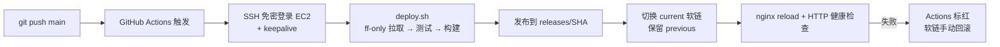

# 自动化部署搭建记录：push 到 main 即自动发布

> 2026-09-04 搭建于 volo-client-fasttest，部署目标为 everecho-aws-dev（EC2 + nginx）。
> 本文记录目的、过程、结果、踩过的坑，以及复用到其他项目的检查清单。

## 1. 目的

之前的手工流程：本地改代码 → push → 自己 SSH 登录服务器 → 手动执行 `scripts/deploy.sh`。
问题：步骤多、容易忘、无法追溯"谁在什么时候部署了什么"。

目标：**git push 到 main 后零操作**，服务器自动完成拉取、测试、构建、原子发布、nginx reload 和健康检查，且全程有日志可查、可回滚。

### 方案选型

| 方案 | 实时性 | 复杂度 | 结论 |
|------|--------|--------|------|
| **A. GitHub Actions + SSH（采用）** | 实时 | 低 | 复用服务器上已验证的 deploy.sh，日志在 GitHub UI |
| B. Webhook + 服务器监听服务 | 实时 | 中 | 免存私钥，但要自写守护进程并长期维护 |
| C. 服务器 cron 轮询 | 分钟级延迟 | 最低 | 不实时；作为 Actions 不可用时的退路 |
| D. Self-hosted runner | 实时 | 中 | 免 SSH 密钥，但要在 EC2 上维护 runner 服务 |

费用说明：**公开仓库 Actions 完全免费不限量**；私有仓库免费账户每月也有 2,000 分钟（本流程单次约 3~5 分钟，足够数百次部署）。

## 2. 架构



核心原则：**Actions 只负责"触发"，一切发布逻辑都在服务器端 deploy.sh 里**——脚本幂等、按 SHA 建发布目录、`current/previous` 软链原子切换、自带健康检查和回滚提示。

## 3. 搭建过程

1. **前置确认**：`gh auth status`（CLI 已登录且有 repo 权限）；`gh api repos/<owner>/<repo>/actions/permissions` 确认 Actions 已启用；服务器端 deploy.sh 已经过多次手动验证。
2. **生成专用部署密钥**：`ssh-keygen -t ed25519 -C "github-actions-deploy-<项目名>"`。与个人登录用的 pem 完全分离，泄露可单独吊销。
3. **公钥上服务器**：追加到 `~/.ssh/authorized_keys`，并立即用新私钥从本地验证免密登录。
4. **写入 GitHub Secrets**（`gh secret set -R <owner>/<repo>`）：
   - `DEPLOY_SSH_KEY`：私钥全文
   - `DEPLOY_HOST_KEY`：`ssh-keyscan <服务器IP>` 的输出，写入 known_hosts 防中间人
5. **deploy.sh 纳入版本管理**：脚本原本只存在于服务器且是 untracked 状态。`scp` 取回本地提交；服务器端把 untracked 副本备份后删除（否则下次 pull 报 "untracked working tree files would be overwritten"）。
6. **创建 workflow** `.github/workflows/deploy.yml`：触发 `push: branches: [main]` + `workflow_dispatch`（手动触发口）；`concurrency` 串行化防并发部署。
7. **首次引导 + 两轮修复**（见第 5 节），最终 push 验证全链路通过。
8. **清理**：删除本地临时私钥文件（私钥只应存在于 GitHub Secrets）。

最终 workflow（关键部分）：

```yaml
on:
  push:
    branches: [main]
  workflow_dispatch:

concurrency:
  group: deploy-production
  cancel-in-progress: false

jobs:
  deploy:
    runs-on: ubuntu-latest
    timeout-minutes: 20
    steps:
      - name: Configure SSH
        env:
          SSH_KEY: ${{ secrets.DEPLOY_SSH_KEY }}
          KNOWN_HOSTS: ${{ secrets.DEPLOY_HOST_KEY }}
        run: |
          mkdir -p ~/.ssh
          printf '%s\n' "$KNOWN_HOSTS" > ~/.ssh/known_hosts
          printf '%s\n' "$SSH_KEY" > ~/.ssh/deploy_key
          chmod 700 ~/.ssh
          chmod 600 ~/.ssh/deploy_key ~/.ssh/known_hosts

      - name: Run deploy script on server
        run: |
          ssh -i ~/.ssh/deploy_key -o BatchMode=yes \
            -o ServerAliveInterval=30 -o ServerAliveCountMax=6 \
            ec2-user@<服务器IP> \
            'PROJECT_DIR=$HOME/projects/<项目目录> bash $HOME/projects/<项目目录>/scripts/deploy.sh'
```

## 4. 结果

- **push 即部署**：每次推送到 main 自动触发，约 3~5 分钟完成（`npm ci` 占大头）。
- **日志可查**：仓库 Actions 标签页有每次部署的完整输出。
- **手动补发**：Actions → Deploy frontend → Run workflow。
- **失败可回滚**：发布按 SHA 隔离，`previous` 软链始终指向上一版：
  ```bash
  sudo ln -sfn /var/www/<web_root>/releases/<旧sha> /var/www/<web_root>/current \
    && sudo systemctl reload nginx
  ```
- 搭建完成当天，后续所有 push（包括本文档）均自动部署成功。

## 5. 遇到的坑

### 5.1 服务器环境变量 `PROJECT_DIR` 被预设（最隐蔽）
远端 shell 环境里遗留了 `PROJECT_DIR=~/projects/EverEcho-backend`，deploy.sh 的默认值 `PROJECT_DIR="${PROJECT_DIR:-...}"` 被覆盖，脚本直接跑去了**别的项目的目录**，报"当前分支是 dev-v2，需要 main"。
**教训**：SSH 远端执行时会加载 `.bashrc`，环境可能被污染。workflow 里必须显式传 `PROJECT_DIR`，不要依赖脚本默认值。SSH 批量执行命令时对"看起来对但目录不对"的症状要警惕。

### 5.2 服务器系统 Node 太旧
系统 Node 是 v18，项目用的 rolldown-vite 需要 Node 20+（报 `util.styleText` 不存在），手动 `npm run build` 必挂。deploy.sh 内部 `export PATH="$HOME/.local/node-v22/bin:$PATH"` 才能构建。
**教训**：部署必须走脚本，不要图省事手动 build；新项目接入前先确认服务器 Node 版本满足构建工具要求。

### 5.3 untracked 脚本造成引导死锁
workflow 第一步就要执行服务器上的 `scripts/deploy.sh`，但"脚本出现在服务器上"这件事本身依赖 deploy.sh 的 `git pull`。首次启用时服务器上既没有 tracked 也没有 untracked 的脚本 → exit 127。
**教训**：首次接入自动化时需要**手动 bootstrap 一次**（先在服务器 pull 把脚本落地），之后才能交给 Actions。反之，把服务器上的 untracked 副本删掉之前，要先确保它已进入版本管理，否则 pull 会冲突。

### 5.4 SSH 长连接被空闲超时掐断
`npm ci` 解析依赖时有约 4 分钟无输出，GitHub Actions 出口 NAT 把无流量的 SSH 连接断掉（`client_loop: send disconnect: Broken pipe`，exit 255），部署死在半路。
**教训**：CI 里经 SSH 跑长命令，**必加** `-o ServerAliveInterval=30 -o ServerAliveCountMax=6`（每 30s 心跳，连续 6 次失败才算断）。任何"CI 里 SSH 几分钟后 Broken pipe"的问题先想这个。

### 5.5 断连后的孤儿进程
SSH 断开后，服务器上的 `npm ci` 进程还活着继续跑（孤儿进程）。本次无害（worktree 干净、current 未切换），但排查时要 `pgrep -af npm` 检查残留，必要时清理。

### 5.6 其他小坑
- 本地仓库配了多个 git remote，`gh secret set` 等命令必须加 `-R <owner>/<repo>`。
- 个人 `~/.ssh/config` 里该主机的 `LocalForward 18000` 在本地端口被占用时每次连接都打印警告——无害，但容易和真正的错误混淆。
- 免费账户不是"私有仓库不能用 Actions"，只是分钟数有限额；公开仓库完全免费。

## 6. 复用到其他项目：检查清单

### 前置条件（缺一不可）
- [ ] 服务器上有**经过手动验证**的部署脚本：幂等、ff-only 拉取、按 SHA 隔离发布、原子切换软链、有健康检查和回滚方案
- [ ] 服务器 Node/构建工具版本满足要求（或脚本内部自带版本管理）
- [ ] 部署脚本**已纳入版本管理**（消除 untracked 状态）
- [ ] 仓库 Actions 已启用（`gh api repos/<owner>/<repo>/actions/permissions`）

### 操作步骤
1. 生成**专用**部署密钥（一个项目一把，注释写清用途，方便吊销）
2. 公钥追加服务器 `authorized_keys`，本地先用新私钥验证登录
3. `gh secret set` 写入 `DEPLOY_SSH_KEY` 和 `DEPLOY_HOST_KEY`（注意多 remote 时加 `-R`）
4. 按 3.6 节模板建 workflow，注意三处：显式传 `PROJECT_DIR`、加 SSH keepalive、`concurrency` 串行
5. **首次手动 bootstrap**：确认服务器已 pull 到含 workflow 的最新代码，再推第一个 commit 或用 workflow_dispatch 触发
6. 观察 Actions 日志走完整个流程，线上验证，删除本地临时私钥

### 安全清单
- [ ] 私钥只存在于 GitHub Secrets；本地临时文件用完即删
- [ ] **公开仓库注意**：workflow 文件里的服务器 IP 是公开可见的。可用 Secret 存主机地址/端口，或评估接受（本次已接受，IP 本就随 SSH 暴露面存在）
- [ ] 进阶加固：`authorized_keys` 该公钥行加 `command="..."` 前缀，强制此密钥只能执行部署命令，即使私钥泄露也开不了 shell
- [ ] 部署密钥不与个人登录密钥混用，人员变动时吊销不影响他人
- [ ] 健康检查失败要有明确信号（脚本非零退出 → Actions 标红），不要静默半成功

### 流程纪律
- [ ] 部署逻辑只改 deploy.sh（版本管理内），不在 workflow 里堆内联脚本
- [ ] 文档型 push 也会触发部署——可接受（幂等重建），介意的话可在 workflow 里加 path 过滤
- [ ] 定期看 Actions 失败率；失败先查第 5 节的坑位清单
